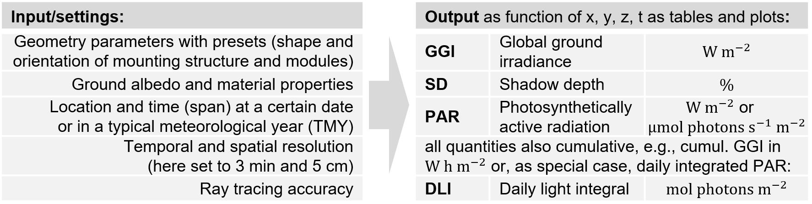
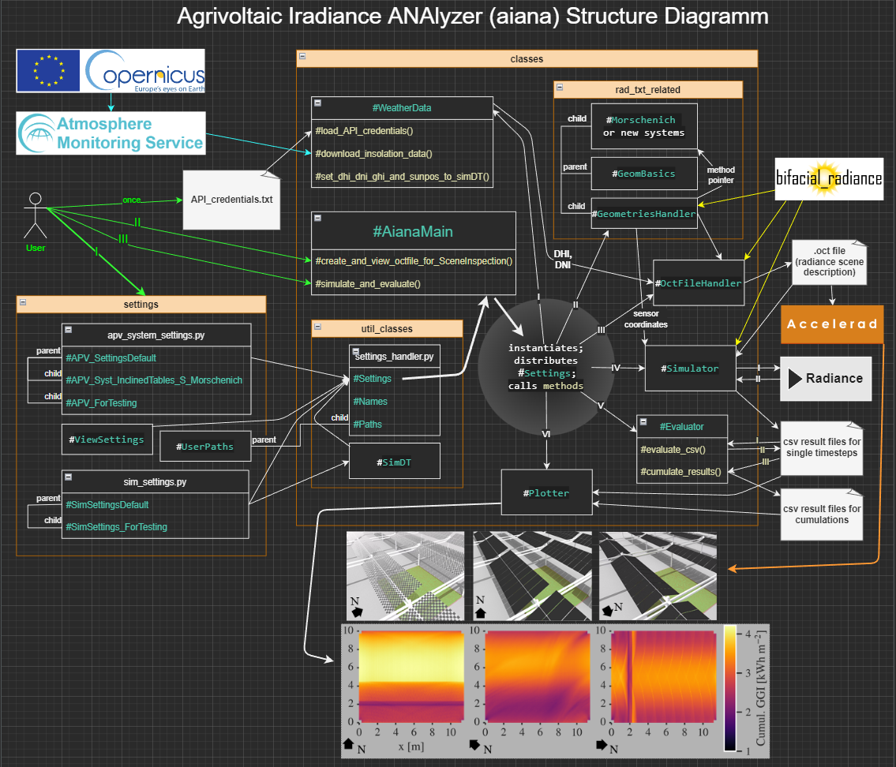

# License
    This program is free software: you can redistribute it and/or modify
    it under the terms of the GNU General Public License as published by
    the Free Software Foundation, either version 3 of the License, or
    (at your option) any later version.

    This program is distributed in the hope that it will be useful,
    but WITHOUT ANY WARRANTY; without even the implied warranty of
    MERCHANTABILITY or FITNESS FOR A PARTICULAR PURPOSE.  See the
    GNU General Public License for more details.

    You should have received a copy of the GNU General Public License
    along with this program.  If not, see <https://www.gnu.org/licenses/>.

    Three methods were copied and modified from bifacrial_radiance, which fall
    under the BSD 3-Clause License.

# Introduction
AIANA is an acronym for "Agrivoltaic Irradiance ANAlyzer", meaning also “everlasting bloom” in native American. It can carry out ray-tracing simulations and evaluates the results in the context of the light availibilty for plants below agrivoltaic systems.

In this 5 min conference poster presentation video the background for this package is introduced:

# Code structure
If this package is opened in vs-code with the drawio extension, you can use the class names in the class_structure.drawio.svg file as links to the source code.

AIANA is connected to the atmosphere data store (ADS) provided by the [Copernicus Atmosphere Monitoring Service (CAMS)](https://ads.atmosphere.copernicus.eu/#!/home) granting up-to-date and high-res satellite weather data (1 min temporal and 5 km spatial resolution for sun irradiance).

AIANA partly uses the open-source package [Bifacial_radiance](https://bifacial-radiance.readthedocs.io/en/latest/), which is a python wrapper for the ray tracer [Radiance](https://www.radiance-online.org).
To add new geometry features, such as e.g. checkerboard and roof top module shapes, automated scan area visualiza-tion, and a mounting structure parametrization, AIANA also communicates directly with Radiance. AIANA also utilizes [Accelerad](https://nljones.github.io/Accelerad/rt.html) for real-time scene inspections and for the GPU-parallelization of the ray tracing simulations.

# Workflow
comming soon

In the settings py.-files or via settings-object overwrites in a working file (see system_studies/minimal_example.py) many options are available.

# Installation
comming soon

Bifacial-radiance
Installation guide: https://www.youtube.com/watch?v=4A9GocfHKyM
Nach der Radiance Installation in Windows 10 nach „Systemumgebungsvariablen bearbeiten“ suchen und prüfen ob der Radiance-Pfad „…/Radiance/bin“ wirklich in der Umgebungsvariable „Pfad“ drin ist (war bei mir erst nicht). Dann gegebenenfalls manuell eintragen.

Software training: https://www.youtube.com/watch?v=1X9L-R-RVGA
PHD defense of Ms. Pelaez: https://www.youtube.com/watch?v=11Jp7GqzLPQ

radiance user manual: https://floyd.lbl.gov/radiance/refer/usman2.pdf

# HOW TO install the apv package in vscode

- make sure that the file path in the terminal ist the one of the
package folder (agri-pv), in which "setup.py" is localized. If you have several folders in your workspace right click agri-pv and choose "Open in Integrated Terminal"

- run command:

      pip install -e .

- restart vscode

- if this did not help, try
    pip uninstall apv
    restart
    pip install -e .
